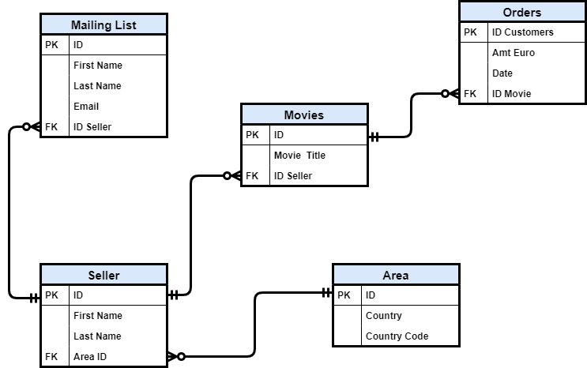

# SQL Tutorial with PostgreSQL

## Introduction
In this repository there are all materials about my tutorial on SQL.

## Topics of the Tutorial

- Part I: [Some Important Key Concepts to start using PostgreSQL](https://towardsdatascience.com/some-important-key-concepts-to-start-using-postgresql-c6de63ab683f?source=friends_link&sk=1eea89c8bf31a5696c975364013e21af)

- Part II: [Working with Multiple Tables thanks to SQL and ERD](https://towardsdatascience.com/working-with-multiple-tables-thanks-to-sql-and-erd-9cb5dcb99228?source=friends_link&sk=7734128676dd5fe6e8f91256f0505d6f)

- Part III: [Window Functions and other concepts of SQL](https://towardsdatascience.com/window-functions-and-other-concepts-of-sql-d53ca756e254?source=friends_link&sk=c89188ef19b39261a6c28e6181821b6f)

## Entity Relationship Diagram

